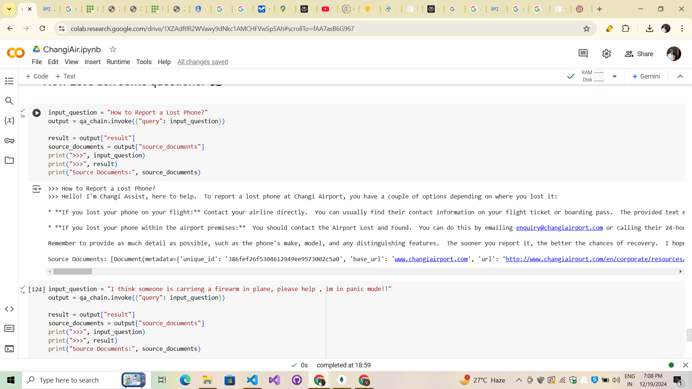
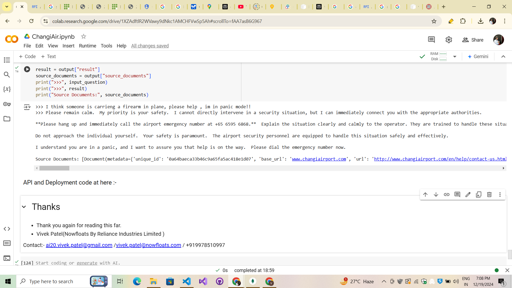

### README.md

# Flask API for Changi Assist QA System

This project implements a Flask API that serves a Question Answering (QA) system Changi Assist. The system uses LangChain and Google's Generative AI models to provide accurate answers to user queries based on indexed content about Singapore Changi Airport.

### Notebook Url :- https://colab.research.google.com/drive/1EqspmRHZ_MAuQSJb7pQS54Gq0otUpW7u?usp=sharing

# Demo



## Features
- **Question Answering**: Retrieve concise answers from indexed documents.
- **Source Tracking**: Provides a list of source URLs with relevant snippets.
- **Embeddings**: Uses Google Generative AI for embedding creation.
- **Document Indexing**: Supports document splitting and FAISS-based indexing for fast retrieval.

## Requirements
- Python 3.8 or higher
- Google API Key for Generative AI

## Installation
1. Clone this repository:
   ```bash
   git clone https://github.com/your-repo/flask-qa-api.git
   cd flask-qa-api
   ```

2. Install dependencies:
   ```bash
   pip install -r requirements.txt
   ```

3. Set up your environment:
   - Add your Google API key as an environment variable:
     ```bash
     export GOOGLE_API_KEY="YOUR_GOOGLE_API_KEY"
     ```

## Dataset Preparation
Ensure you have a CSV file named `multi_level_crawl.csv` with the following columns:
- `unique_id`: Unique identifier for each document.
- `base_url`: Base URL of the document.
- `url`: Full URL of the document.
- `content`: Text content of the document.
- `depth`: Crawling depth of the document.

The Flask app uses this CSV file to build an indexed database of documents for retrieval.

## Usage

### Running the API
1. Start the Flask server:
   ```bash
   python app.py
   ```

2. Access the API at `http://127.0.0.1:5000` (or as specified by your host and port).

### API Endpoints

#### `/ask` (POST)
- **Description**: Submits a question to the QA system.
- **Request**:
  ```json
  {
      "question": "Your question here"
  }
  ```
- **Response**:
  ```json
  {
      "question": "Your question here",
      "answer": "The answer generated by the system",
      "sources": [
          {
              "url": "Source URL",
              "content_snippet": "Snippet from the document"
          }
      ]
  }
  ```

### Testing the API
Use tools like [Postman](https://www.postman.com/) or `curl` to test the `/ask` endpoint. Example:
```bash
curl -X POST http://127.0.0.1:5000/ask \
-H "Content-Type: application/json" \
-d '{"question": "What are the dining options at Changi Airport?"}'
```

## Deployment
You can deploy this API on any platform that supports Flask, such as:
- AWS Elastic Beanstalk
- Google Cloud Run
- Heroku
- Docker (recommended for containerization)

### Exposing the API for Public Access
Use a tunneling service like `ngrok` to expose your local Flask server:
```bash
ngrok http 5000
```

## Acknowledgments
This project uses the following technologies and libraries:
- [Flask](https://flask.palletsprojects.com/): Web framework for building the API.
- [LangChain](https://www.langchain.com/): Framework for LLM-based applications.
- [FAISS](https://github.com/facebookresearch/faiss): Library for efficient similarity search.

---